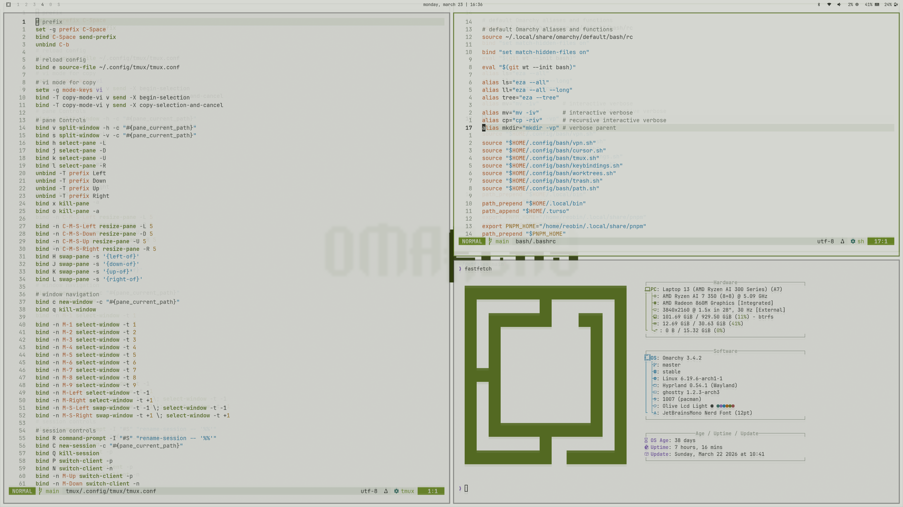

# `omarchy-olive-crt-light-theme`

`omarchy-olive-crt-light-theme` is a light Omarchy theme built around [`vimcolorschemes/olive-crt.nvim`](https://github.com/vimcolorschemes/olive-crt.nvim).



## Installation

```bash
omarchy-theme-install https://github.com/reobin/omarchy-olive-crt-light-theme.git
```

## Usage

Select `olive-crt-light` from the Omarchy theme picker, or apply it with:

```bash
omarchy-theme-set olive-crt-light
```
